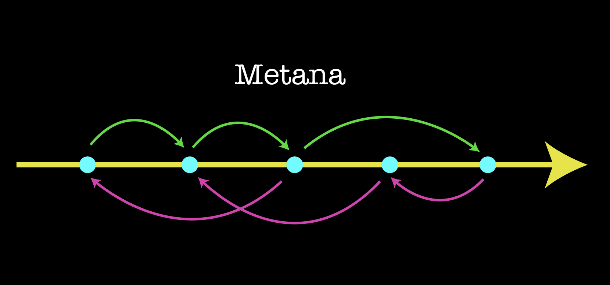

# Metana


[](http://golang.org)
[](https://github.com/g14a/metana)
[](https://goreportcard.com/report/github.com/g14a/metana)
[](https://github.com/g14a/metana/workflows/Go/badge.svg)

An abstract task migration tool written in Go for Go services. Database and non database migrations management brought to your CLI.

# Table of Contents

* [Use case](https://github.com/g14a/metana#use-case)
* [Installation](https://github.com/g14a/metana#installation)
    * [Using Go](https://github.com/g14a/metana#using-go)
    * [macOS](https://github.com/g14a/metana#mac)
    * [Linux](https://github.com/g14a/metana#linux)
    * [Building from Source](https://github.com/g14a/metana#building-from-source)
    * [Docker](https://github.com/g14a/metana#docker)
* [Usage](https://github.com/g14a/metana#usage)
    * [Init](https://github.com/g14a/metana#init) ✅
    * [Create](https://github.com/g14a/metana#create) 👌 
    * [Up](https://github.com/g14a/metana#up) ⬆️
    * [Down](https://github.com/g14a/metana#down) ⬇️
    * [Wipe](https://github.com/g14a/metana#wipe) 💅
    * [List](https://github.com/g14a/metana#list) 
* [Features](https://github.com/g14a/metana#features)
    * [Custom directory to store migrations](https://github.com/g14a/metana#custom-directory-to-store-migrations)
    * [Run migrations until a certain point](https://github.com/g14a/metana#run-a-migration-until-a-certain-point)
    * [Store and Track your migrations in your favourite database](https://github.com/g14a/metana#store-and-track-your-migrations-in-your-favourite-database)
    * [Dry Run Migrations](https://github.com/g14a/metana#dry-run-migrations)
    * [Custom Config](https://github.com/g14a/metana#custom-config)
    * [Wipe out stale migrations](https://github.com/g14a/metana#wipe-out-stale-migrations)
    * [Custom Templates for Migrations](https://github.com/g14a/metana#add-custom-templates-for-migrations)
    * [Shell Completions](https://github.com/g14a/metana#shell-completions)
    * [Secrets and Environment Keys](https://github.com/g14a/metana#secrets-and-environment-keys-while-running-migrations)
    * [Managing Environments](https://github.com/g14a/metana#environments)
        * [Create a migration in an environment](https://github.com/g14a/metana#create-a-migration-in-a-specific-environment-with-the-same---env-flag)
        * [Run migrations in an environment](https://github.com/g14a/metana#run-migrationsboth-up-and-down-in-an-environment)
        * [Config for Environments](https://github.com/g14a/metana#config-for-environments)
    
# Use case

The motivation behind creating this tool, is to abstract away the database part. If your task can be completed with Pure Go or via a Go driver of your service, then this is for you. Since it makes use of the Go runtime, you can even perform database migrations like PostgreSQL, Mongo, Redis, Elasticsearch, GCP Buckets etc. You just need to be able to interact with your data store or complete your task using Go.

The main use case is when you won't be able to do everything with SQL or No-SQL syntax. There might be some tasks where you need to aggregate data, iterate over them, and do business related stuff with the retrieved data. All you need to know is Go syntax and write a Go program.

# Installation

## Using Go
```shell
go get github.com/g14a/metana
```

## **Mac**

```shell
homebrew tap g14a/homebrew-metana
homebrew install metana
```
## **Linux**

Checkout the releases page and download your platform's binaries to install them.

[Releases Page](https://github.com/g14a/metana/releases)

## **Building from source**

Prerequisites:

* Git
* Go 1.13 or newer. Go modules are needed. Better if its the latest version.

```shell
git clone https://github.com/g14a/metana
cd metana
go install
```

## **Docker**
```shell
docker pull g14a/metana
docker run g14a/metana
```

# Usage

After installation, let's just hit metana on the terminal.

```shell
$ metana

An abstract migration tool for all types of migrations

Usage:
  metana [command]

Available Commands:
  config      Manage your local metana config in .metana.yml
  create      Create a migration in Go
  down        Run downward migrations
  help        Help about any command
  init        Initialize a migrations directory
  list        List existing migrations
  up          Run upward migrations
  wipe        Wipe out old stale migration files and track in your store


Flags:
      --config string   config gen (default is $HOME/.metana.yaml)
  -h, --help            help for metana
  -t, --toggle          Help message for toggle

Use "metana [command] --help" for more information about a command.
```

## **`Init`**

`init` initializes a boilerplate migrations directory in your current path.

```shell
$ metana init
 ✓ Created /Users/g14a/metana/migrations/main.go
```

By default it will create a `migrations` folder if no such folder exists. If it does, it adds the `main.go` file into the same.

If you want to initialize migrations in a different directory, you can do so with the `--dir | -d` flag:

```shell
metana init --dir /path/to/folder
```

## **`Create`**

`create` creates a migration script with two functions `Up()` and `Down()` denoting the upward and downward migration of the same.

```shell
$ metana create initSchema
 ✓ Created /Users/g14a/metana/migrations/1614532908-Sample.go
 ✓ Updated /Users/g14a/metana/migrations/main.go
```

Head over to your `1614532908-InitSchema.go` to edit your script. Remember to not change any function signature.

## **`Up`**

`up` runs all the upward migrations in the migrations directory in order of their creation time.

```shell
$ metana up

  >>> Migrating up: 1619942687-InitSchema.go
InitSchema up

  >>> Migrating up: 1619942704-AddIndexes.go
AddIndexes up

  >>> migration : complete
```

## **`Down`**

`down` runs the downward migrations in the reverse order of creation time because we're trying to undo the upward migrations.

```shell
$ metana down

  >>> Migrating down: 1619942704-AddIndexes.go
  AddIndexes down

  >>> Migrating down: 1619942687-InitSchema.go
  InitSchema down

  >>> migration : complete
```

## **`Wipe`**

`wipe` removes stale(already executed) migration files and track in your store to keep things clean.

```shell
$ metana wipe 
                                                                            
? Wiping will delete stale migration files. Continue? Yes
```

## **`List`**

`list` lists all the migrations present in your migrations folder along with the last modified time.

```shell
$ metana list

  +----------------------------------+------------------+
  |            MIGRATION             |  LAST MODIFIED   |
  +----------------------------------+------------------+
  | 1619943670-InitSchema.go         | 02-05-2021 13:51 |
  | 1619943677-AddIndexes.go         | 02-05-2021 13:51 |
  | 1619943874-AddFKeys.go           | 02-05-2021 13:54 |
  | 1619943888-AddBoilerPlateRows.go | 02-05-2021 13:54 |
  +----------------------------------+------------------+
```

# Features

## **Custom directory to store migrations**

Specify a custom directory when creating and running upward or downward migrations using the `--dir` flag. Be default it is set to `"migrations"`

```shell
$ metana init --dir schema-mig
 ✓ Created /Users/g14a/metana/schema-mig/main.go

$ metana create initSchema --dir schema-mig
 ✓ Created /Users/g14a/metana/schema-mig/scripts/1619943164-InitSchema.go
 ✓ Updated /Users/g14a/metana/schema-mig/main.go
 
$ metana up --dir schema-mig
  >>> Migrating up: 1619943670-InitSchema.go
InitSchema up

  >>> migration : complete

```

## **Run a migration until a certain point**

Run upward and downward migrations until(and including) a certain migration with the `--until` flag.

```shell

$ metana create initSchema                                                                
 ✓ Created /Users/g14a/metana/migrations/scripts/1619942687-InitSchema.go
 ✓ Updated /Users/g14a/metana/migrations/main.go
 
$ Create more migration scripts...

$ metana list

  +----------------------------------+------------------+
  |            MIGRATION             |  LAST MODIFIED   |
  +----------------------------------+------------------+
  | 1619943670-InitSchema.go         | 02-05-2021 13:51 |
  | 1619943677-AddIndexes.go         | 02-05-2021 13:51 |
  | 1619943874-AddFKeys.go           | 02-05-2021 13:54 |
  | 1619943888-AddBoilerPlateRows.go | 02-05-2021 13:54 |
  +----------------------------------+------------------+

$ metana up --until AddFkeys                                                                

  >>> Migrating up: 1619942687-InitSchema.go
InitSchema up

  >>> Migrating up: 1619942704-AddIndexes.go
AddIndexes up

  >>> Migrated up until: 1619942704-AddIndexes.go

  >>> migration : complete

$ metana down --until AddIndexes
  
  >>> Migrating down: 1619943888-AddBoilerPlateRows.go
AddBoilerPlateRows down

  >>> Migrating down: 1619943874-AddFKeys.go
AddFKeys down

  >>> Migrating down: 1619943677-AddIndexes.go
AddIndexes down

  >>> Migrated down until: 1619943677-AddIndexes.go

  >>> migration : complete

```

Notice the capitalized format when passing to `--until`.

## **Store and track your migrations in your favourite database**

Store and track your migrations in your favourite database by passing the `--store` flag.

```shell
metana up --store <db-connection-url>
```

If your connection URL is store in an environment variable you can pass it as `--store @MONGO_URL` and it will automatically be picked up from your environment.

Right now, PostgreSQL(which means even CockroachDB URLs) and MongoDB are supported to store migrations.

If no `--store` flag is passed, migrations will be stored in a default `migrate.json` file in the migrations directory.

## **Dry run migrations**

Dry run your migrations using the `--dry` flag.

You can dry run your migrations using the explicit `--dry` option. This option doesn't track any migrations, doesn't create a default `migrate.json` file. It literally just dry runs. However your tasks are run. This helps when you're incrementally writing, testing and running your functions instead of manually deleting states in your store.

```shell
$ metana up --dry

  >>> Migrating up: 1619942687-InitSchema.go
InitSchema up

  >>> Migrating up: 1619942704-AddIndexes.go
AddIndexes up

  >>> dry run migration : complete
```

```shell
$ metana down --dry

  >>> Migrating down: 1619942704-AddIndexes.go
AddIndexes down

  >>> Migrating down: 1619942687-InitSchema.go
InitSchema down

  >>> dry run migration : complete
```

All the other options like `--dir` and `--until` work along with `--dry`.

## **Custom config**

Set your custom config in your `.metana.yml` file. As of now it supports `dir` and `store` keys.

For eg:
```
dir: schema-mig
store: '@MONGO_URL'
```

Remember to add it to your git unless you want to miss migrations on deployments.

If your store has a remote database URL you can specify it via '@<url>' syntax and it will automatically be picked up from your environment variables (Remember the single quotes).You don't want to hardcode API Keys and connection URLs in your codebase.

`.metana.yml` is created automatically when you run `metana init` which can be used for subsequent migration operations.

You can either manually add the config on to the `.metana.yml` file or do it via

`metana config set --store @MONGO_URL`

```shell
$ metana config set --help
Set your metana config

Usage:
  metana config set [flags]

Flags:
  -d, --dir string     Set your migrations directory (default "migrations")
  -h, --help           help for set
  -s, --store string   Set your store

```

<span style="color:red">CAUTION: </span>
If you change the dir flag in your `.metana.yml` after running `metana init`, don't forget to rename your migrations directory to the new directory. Otherwise running migrations would result in failure.

Priority order of config:

1. Flags passed explicitly
2. `.metana.yml` if it exists.
3. Default values of flags.


## **Wipe out stale migrations**

Wipe out stale(already executed) migration files and update your store with the `wipe` command.

```shell
$ metana wipe

Wipe out old stale migration files and track in your store

Usage:
  metana wipe [flags]

Flags:
  -d, --dir string     Specify custom migrations directory
  -h, --help           help for wipe
  -s, --store string   Specify a connection url to track migrations
  -y, --yes            Proceed at all costs i.e by pass the prompt

Global Flags:
      --config string   config gen (default is $HOME/.metana.yaml)
```

Pass the ``-y`` flag to bypass the prompt during script.

Even the `wipe` command takes configuration from your `.metana.yml` file one exists.
Otherwise the priority order is considered while wiping.

## **Add Custom templates for Migrations**

With the latest version of metana you can add create a custom template Go program
and create migration scripts with that.

Your template should be a valid Go program(atleast syntactically) and needs
to have an `Up()` and a `Down()` function returning an error.
Spaces between the function name and the returning error are taken care of.
The contents of your `Up()` and `Down()` will be copied into the migration script.

So the following signatures are valid for now:

- `func Up() error {}`
- `func Up() (err error) {}`
- `func Down() error {}`
- `func Down() (err error) {}`

Create a migration with a template with the `--template` flag:

```shell
metana create addIndexes --template ../path/to/template.go
```

## **Shell Completions**

You can get enable shell completions to metana by doing

```shell
metana completion --help
```

and selecting your shell.

```shell
$ metana completion --help

To load completions:

Bash:

  $ source <(metana completion bash)

  # To load completions for each session, execute once:
  
  # Linux:
  $ metana completion bash > /etc/bash_completion.d/metana
  
  # macOS:
  $ metana completion bash > /usr/local/etc/bash_completion.d/metana

Zsh:

  # If shell completion is not already enabled in your environment,
  # you will need to enable it.  You can execute the following once:

  $ echo "autoload -U compinit; compinit" >> ~/.zshrc

  # To load completions for each session, execute once:
  $ metana completion zsh > "${fpath[1]}/_metana"

  # You will need to start a new shell for this setup to take effect.

fish:

  $ metana completion fish | source

  # To load completions for each session, execute once:
  $ metana completion fish > ~/.config/fish/completions/metana.fish

PowerShell:

  PS> metana completion powershell | Out-String | Invoke-Expression

  # To load completions for every new session, run:
  PS> metana completion powershell > metana.ps1
  # and source this file from your PowerShell profile.

Usage:
  metana completion [bash|zsh|fish|powershell]

Flags:
  -h, --help   help for completion

Global Flags:
      --config string   config gen (default is $HOME/.metana.yaml)
```

## Secrets and Environment keys while running migrations

Now you can run upward and downward migrations and specify your `.env` files.

Use the `--env-file` flag to do so. By default the value is set to `.env`.

```shell
$ metana up --env-file dev.env
 ✓ .metana.yml found
  >>> Migrating up: 1623502023-InitSchema.go

InitSchema up

  >>> migration : complete

```

# Environments
With metana, you can manage your multiple environments in your migrations setup.

You can manage your deployments like `dev`, `staging`, and `production` etc.

It is recommended that you either manage environments, or the traditional `metana init` way.

To initialize a environment, run `metana init` with the `--env` flag. 

All environments need to be unique.

### Initialize an environment `dev`.

```shell
$ metana init --env dev
 ✓ Created /Users/g14a/metana/migrations/environments/dev/main.go
$ metana init --env dev
 Environment `dev` already exists
```

### Create a migration in a specific environment with the same `--env` flag.

```shell
$ metana create initSchema --env dev
 ✓ .metana.yml found
 ✓ Created /Users/g14a/metana/migrations/environments/dev/scripts/1623502023-InitSchema.go
 ✓ Updated /Users/g14a/metana/migrations/environments/dev/main.go
```

```shell
$ metana create initSchema --env staging
 ✓ .metana.yml found
 ✓ Created /Users/g14a/metana/migrations/environments/staging/scripts/1623502023-InitSchema.go
 ✓ Updated /Users/g14a/metana/migrations/environments/staging/main.go
```

### Run migrations(both up and down) in an environment

```shell
$ metana up --env dev

 ✓ .metana.yml found
  >>> Migrating up: 1623502023-InitSchema.go

InitSchema up

  >>> migration : complete

```

All the other flags like `--dry`, `--until`, `--dir` work with environments seamlessly.

### Config for environments

You can specify your environment configuration in the same `.metana.yml` file.

```yaml
dir: migrations
store: ""
environments:
- name: dev
  store: "dev store"
- name: staging
  store: "staging store"
- name: prod
  store: "prod store"
```

The `name` field of the config should be the same as the environment directory inside `/environments/`.